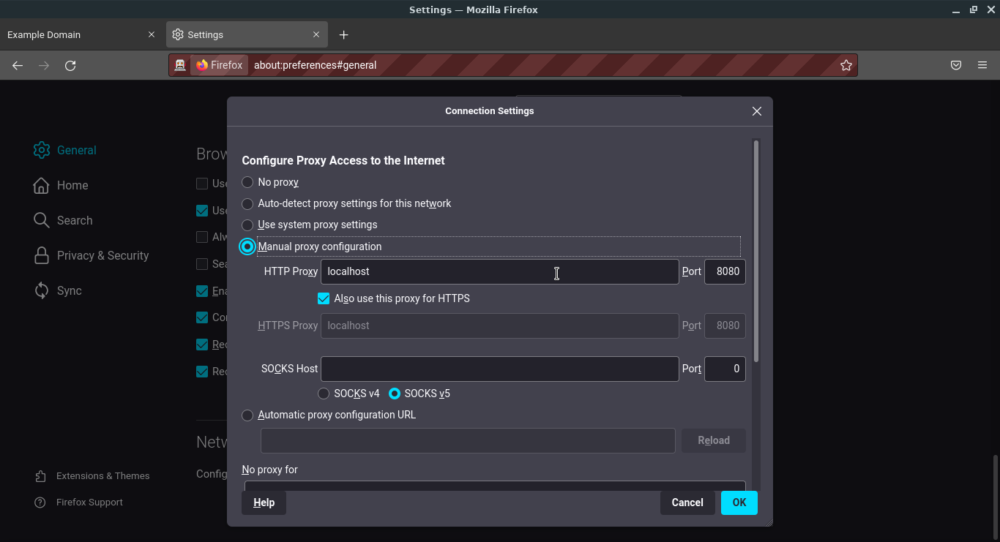
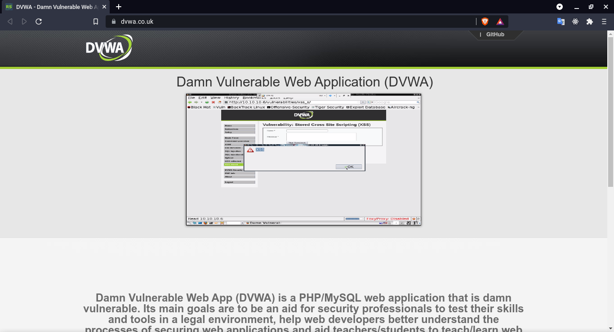
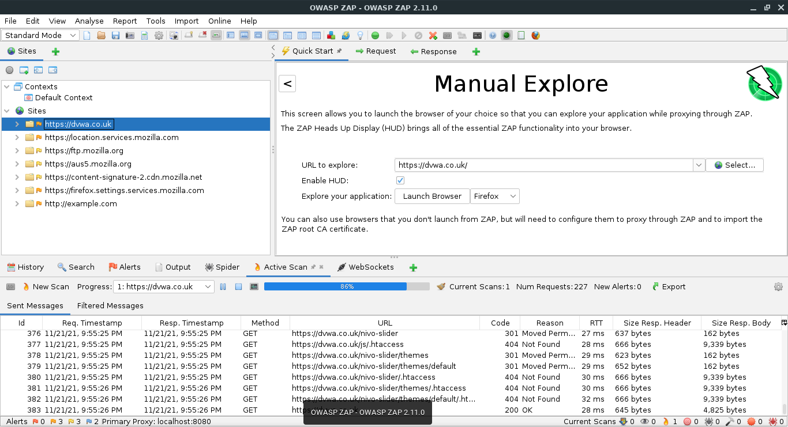
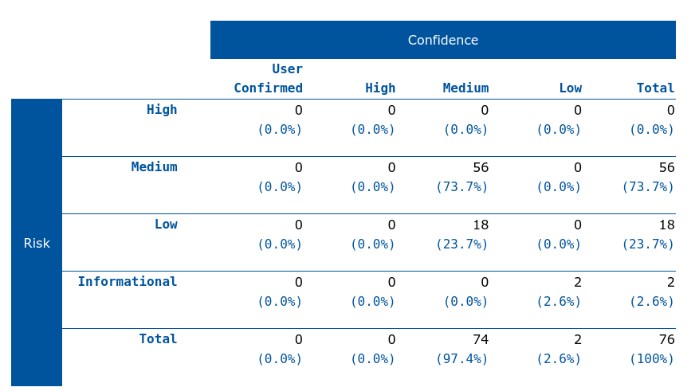

# Practica 6: Pruebas de seguridad y OWASP - ZAP

## Objetivos:

1. Automatizar pruebas de seguridad de aplicaciones Web utilizando OWASP ZAP.

## Pre - requisitos

* Java 8 o superior
* [OWASP ZAP](https://www.zaproxy.org/)
* SO: Linux Lite 5.6

## Actividades: 

* Configurar el proxies:

    

* Implementar pruebas de penetración de seguridad de aplicaciones Web utilizando OWASP ZAP sobre una aplicación web apropiada con propósitos de pruebas de seguridad.

    1. **Implementar caso de prueba**:
        
        

    2. **Ejecutar los casos de prueba**:
        
        
    3. **Reportar resultados**:

        